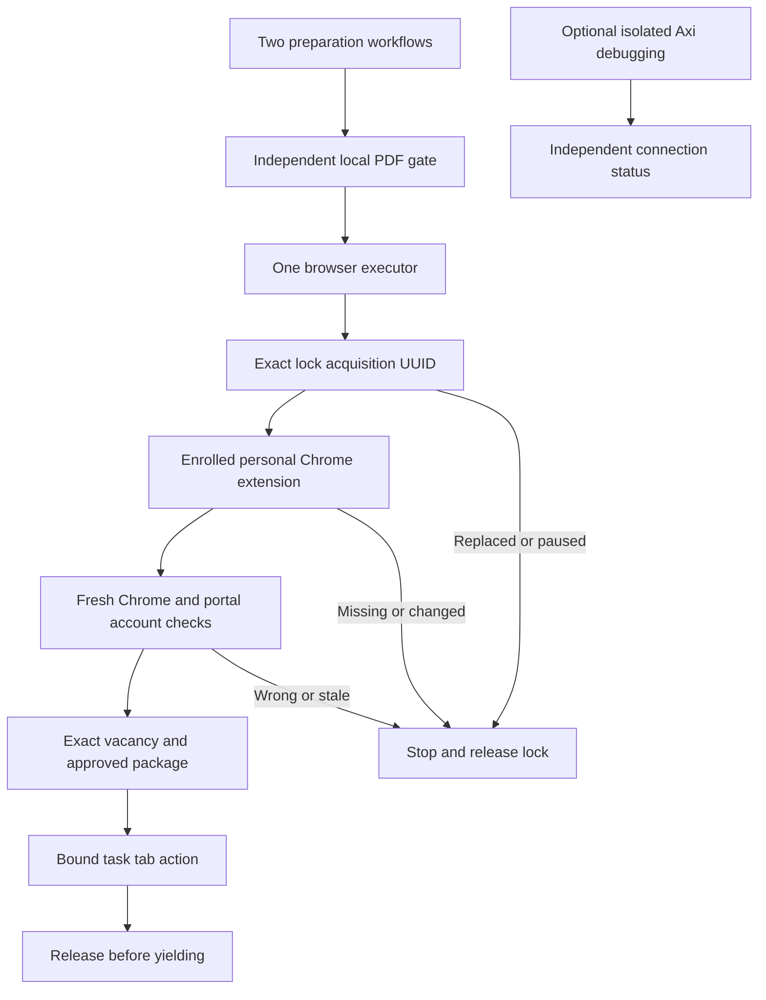

# Legacy personal Chrome connector for job applications

This procedure is currently incompatible with the Zen-only browser policy.
It documents the existing fail-closed gate but does not authorize launching Chrome or using native Zen as a substitute.
Stop external execution until a Zen-compatible connector and account-bound gate have been verified; do not run the enrollment steps below in the meantime.

`../job-policy.json` owns the expected account, window, browser family, evidence lifetime, and denied profiles.
`../scripts/job-browser-gate.py` checks connector metadata and minimal visible observations without launching a browser.
Run it with Python 3 through the active `~/.agents/skills/browser-routing` path.
Local PDF validation and isolated Axi debugging have separate prerequisites.

## Enroll once after installation or extension replacement

Install the official ChatGPT extension in the personal Chrome profile through Codex Settings > Computer Use > Google Chrome.
Disable that extension in the support profile to remove support from browser-provider discovery.
Review security-sensitive permission expansion with Dmitri at action time.
Native Computer Use cannot operate Codex's own settings; ask Dmitri to complete that step when the host blocks it.
During this explicitly authorized setup only, visibly verify Chrome's profile popup shows the account from the policy and name its dedicated window `write`.
Do not infer the account from a display name or a window title.

Use `await cua.listBrowsers({emit:false})` for connector metadata only, never `getState` or broad tab inventories.
Do not bind an unknown connector or emit unrelated tab titles, URLs, or contents.
Pass a minimal JSON observation on stdin to `job-browser-gate.py enroll`:

```json
{"chromeAccount":"jdmitri1999@gmail.com","window":"write","family":"chrome","type":"extension","profileName":"<observed personal connector name>","extensionInstanceId":"<observed personal extension instance ID>"}
```

Enrollment is machine-local under a private `/private/tmp/job-browser-gate-<uid>` directory.
Loss of that directory or extension replacement requires fresh enrollment.
The extension instance ID is the selector; mutable numeric browser IDs and profile labels alone are insufficient.

## Each bounded browser turn

1. Check the coordinator's manual takeover pause and acquire the browser lock for the exact assigned job.
   Preserve its acquisition UUID; matching owner alone is insufficient.
2. Run `job-browser-gate.py invalidate` on resume, restart, account chooser, profile/window change, navigation to another portal, or uncertainty.
   Generate a new session ID on every fresh or resumed Computer Use session.
3. Obtain only browser metadata with `cua.listBrowsers({emit:false})` and pass that JSON on stdin to `job-browser-gate.py route`.
   A blocked result means stop and release the lock, even when support is the only visible connector.
4. Select the exact returned instance with `cua.getBrowser({extensionInstanceId: "<verified route result>"})`.
   Use its returned browser ID for task-owned `createBrowserTab` or exact `getTab` calls.
   Never use generic `"chrome"`, first-browser selection, Axi, or a native Chrome fallback for job execution.
5. Read only the bound task's identity controls until the Chrome/Google account and portal login email are visibly verified.
   A resume contact email does not prove the portal login identity.
   A signed-out or unknown account requires authentication before form actions.
6. Pass those visible observations to `attest`, using this minimal schema:

```json
{"chromeAccount":"jdmitri1999@gmail.com","window":"write","portalAccount":"jdmitri1999@gmail.com","sessionId":"<fresh session UUID>","tabId":"<exact task tab>","portalHost":"<hostname only>","owner":"job-284","acquisitionId":"<owned browser lock UUID>"}
```

7. Immediately before each account, form, upload, email, or submission action, repeat `route` with current connector metadata and `check` with that exact context.
   Re-observe and `attest` if evidence is older than 60 seconds.
   Changed account, tab, portal, session, or lock generation blocks the action.
   The job skill's vacancy and package gates remain required independently.
8. Release the exact lock generation in cleanup after success, error, cancellation, human request, pause, and before yielding.
   A scoped UI `try/finally` must not extend across a user wait.
   Retained locks require the coordinator's exact-owner recovery procedure.

Before directing Dmitri to manual takeover, set the coordinator pause and run `job-browser-gate.py pause`.
This invalidates evidence and blocks every gate consumer.
Run `resume` only after Dmitri explicitly returns control; fresh attestation is required.
Do not clear a pause because time elapsed.

## Diagnostics and limits

`job-browser-gate.py doctor`, also available as `~/.local/bin/chrome-devtools-axi doctor jobs`, distinguishes enrollment, fresh identity, takeover, local PDF checks, and optional Axi debugging.
It never starts Axi or inspects personal Chrome contents.
An inactive Axi session says nothing about the personal Computer Use connection.

The helper rejects invalid routing and evidence for callers that use it.
Visible observations are supplied by the executor; they are not cryptographic account attestations.
It cannot intercept arbitrary raw Computer Use calls or make a shared macOS Chrome application inaccessible.
Disabling the support extension excludes that profile from the browser connector, but native Chrome access remains broader.
For strict host isolation, remove native app access from a browser executor if the host supports that scope, or use a separate macOS user/session containing only the personal profile.
Do not describe instruction-only preparation roles as host-enforced tool removal.
Preparation workers must not receive browser tasks; the sole executor uses the enrolled connector.
If an upload requires an unavailable native dialog, request the specific manual action rather than falling back to another profile.

Run `python3 scripts/test_job_browser_gate.py` to validate rejection paths and the enroll-to-pause lifecycle.


